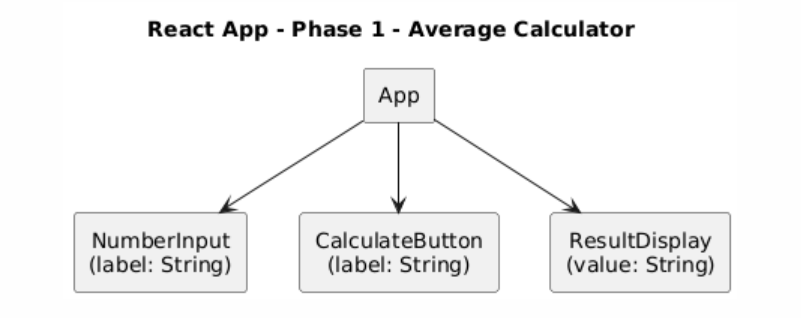
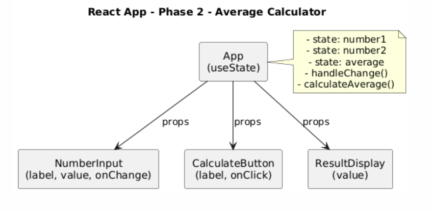

# React Average Calculator – Phase 1 & Phase 2

📌 Project Summary

This mini React project was developed in two phases. It is a single-page application that calculates the average of two numbers entered by the user. The application was created using React (via CDN), Babel for JSX transformation, and pure HTML/CSS for layout and styling.

---

## 🌐 Hosting URL

🖥️ Live Demo:  
**https://lydianeghad.alwaysdata.net/react-average-calculator/index.html**

---

## 🧩 Phase 1 – Interface Only (No Functionality)

**Objective**: Build the full interface without logic.

✅ Features:

- Interface created with **React via CDN**
- JSX compiled with **Babel**
- Functional components only
- 1 parent component: `App`
- 3 child components:
  - `NumberInput`: labeled number fields
  - `CalculateButton`: static button
  - `ResultDisplay`: static result field
- Props passed from parent to children
- ❌ No `state`, ❌ no event handling, ❌ no interactivity

🖼️ Diagram: `Diagram-phase1.PNG`

---

## ⚙️ Phase 2 – Logic and Interactivity

**Objective**: Add reactivity and behavior.

✅ Added Features:

- State management using `useState`
- Controlled inputs with `onChange`
- `calculateAverage()` function triggered on click
- Dynamic result display with color feedback:
  - 🔴 Red if input is invalid
  - 🟢 Green if result is valid
  - ⚫ Gray if empty
- Modern and responsive CSS design
- Removed "Reset" button as per team decision

🖼️ Diagram: `Diagram-phase2.PNG`

---

## 🧪 Technologies Used

- React 17 (CDN)
- ReactDOM (CDN)
- Babel (CDN)
- Vanilla HTML & CSS (no frameworks)

---

## 👥 Team Members

- Lydia NEGHAD  
- Tohavina RAMANANJATOVO

---

## 📎 Included Files

- `index.html` – full working app with interface & logic  
- `Diagram-phase1.PNG` – component hierarchy (Phase 1)  
- `Diagram-phase2.PNG` – data flow & state (Phase 2)  
- `README.txt` – this document

---

## ✅ How to Use

1. Open the link or the local `index.html` in your browser  
2. Enter two numbers  
3. Click **Calculate Average**  
4. View the result displayed dynamically

---

## 🚧 Notes

- Built without `npm`, `create-react-app`, or modules  
- 100% client-side: React, JSX, and Babel via CDN  
- Mobile responsive with minimalist styling
